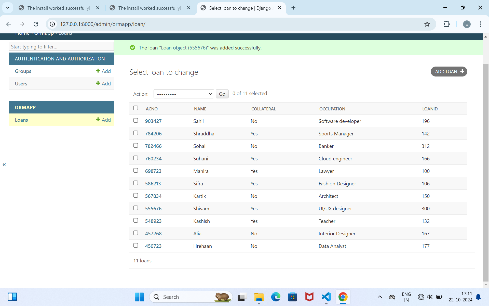

# Ex02 Django ORM Web Application
## Date: 26.10.2024

## AIM
To develop a Django application to store and retrieve data from a bank loan database using Object Relational Mapping(ORM).

## ENTITY RELATIONSHIP DIAGRAM

.png>)

## DESIGN STEPS

### STEP 1:
Clone the problem from GitHub

### STEP 2:
Create a new app in Django project

### STEP 3:
Enter the code for admin.py and models.py

### STEP 4:
Execute Django admin and create details for 10 books

## PROGRAM

```
admin.py

from django.contrib import admin
from .models import Loan,LoanAdmin
admin.site.register(Loan,LoanAdmin)

models.py

from django.db import models
from django.contrib import admin
class Loan(models.Model):
  acno=models.IntegerField(primary_key="acno")
  name=models.CharField(max_length=25)
  collateral=models.Charfield(max_length=3)
  occupation=models.CharField(max_length=20)
  loanid=models.IntegerField()

class LoanAdmin(admin.ModelAdmin)
 list_display=('acno','name','collateral','occupation','loanid')
  
  
  


```

## OUTPUT




## RESULT
Thus the program for creating a database using ORM hass been executed successfully
